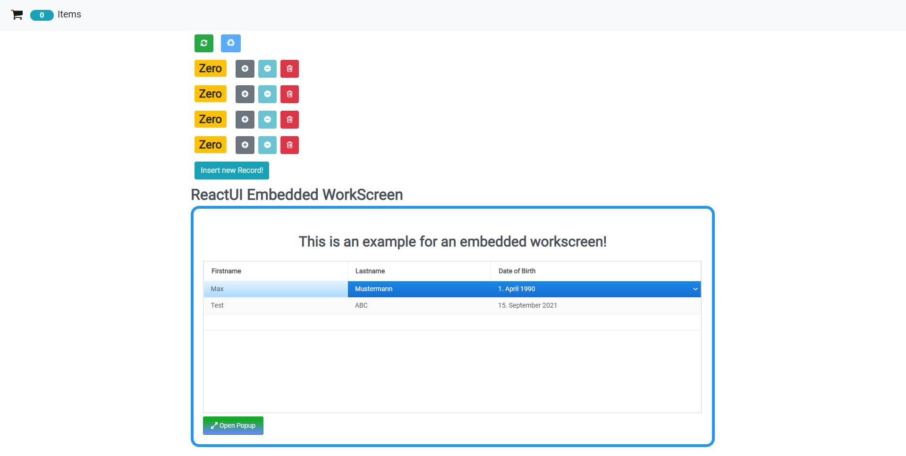

# Overview

Embed [reactUI](https://github.com/sibvisions/reactUI/) into another [react application](https://github.com/arnab-datta/counter-app). It's only a demo application to show how embedding is possible.

## Dev Setup
- run `npm install` in your reactUI and reactUI.embedding projects
- run `npm link` in your reactUI directory
- run `npm link reactUI` in your reactUI.embedding directory
- run `npm link ../reactUI/node_modules/react` in your reactUI.embedding directory to prevent react collision errors
- run `npm run bundle` in your reactUI directory to update the lib
- run `npm start` in your reactUI.embedding directory

## Example
If you want to embed ReactUI in your react project import the ReactUI component and pass the `embedded` property. Then it is also required to add embeddedOptions to launch the correct application, set the baseUrl to communicate with the server, language and authentication.

### embeddedOptions properties
In general embeddedOptions is not typed so it is possible to add any properties to it, but there are some which are necessary, pay attention to typing and casing!
Parameter | Type | Description
--- | --- | --- |
appName | string | Name of the application you want to launch.
baseUrl | string | The url which will be used to communicate with the server.
language | string | The language code which will be used for translation.
userName | string | The username which will be used for authentication
password | string | The password used for authentication

```typescript
  return (
    <div>
      <NavBar
        totalCounters={counters.filter(c => c.value > 0).length}
      />
      <main className="container">
        <Counters
          counters={counters}
          onReset={handleReset}
          onIncrement={handleIncrement}
          onDecrement={handleDecrement}
          onDelete={handleDelete}
          onRestart={handleRestart}
        />
        <div> 
          <button className="btn btn-info m-2" onClick={handleButtonClick}>Insert new Record!</button>
        </div>
        <ReactUI style={{height: '500px'}} onLogin={onLogin} embedded embeddedOptions={{appName:"countertest", baseUrl:"http://localhost/services/mobile", language:"de", userName:"admin", password:"admin"}}/>
      </main>
    </div>
  );
```
In my example I've set a height of 500px for the ReactUI so it isn't too big.
